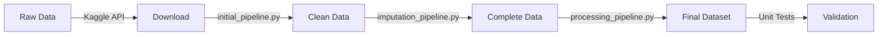

## Executive Summary

The **Fitbit Health Metrics Analysis Dataset** transforms raw Fitbit data into clinically aligned health insights by using evidence-based metrics and risk guidelines. This project bridges the gap between consumer wearable data and actionable health insights by integrating clinical standards with continuous monitoring data.

### Motivation
Current fitness tracking applications and datasets typically provide basic activity metrics without clinical context or comprehensive health analysis. This project solves three key challenges:
1. Lack of clinically-validated interpretation of wearable data
2. Absence of comprehensive recovery and strain analysis
3. Limited integration of sleep, activity, and cardiovascular health metrics

### Potential Applications
- **Clinical Research**: Validate intervention effectiveness using real-world data
- **Preventive Healthcare**: Early identification of cardiovascular risks
- **Personal Health**: Data-driven lifestyle optimization
- **Sports Science**: Recovery and training load optimization
- **Sleep Research**: Analysis of sleep patterns and their health impacts

## Dataset Review

### Previous Datasets in the Domain
Healthcare wearable datasets traditionally lack comprehensive health insights:

1. **Raw Activity Datasets**
   - **[Fitabase Data](https://www.kaggle.com/arashnic/fitbit)**
     - Basic activity and sleep metrics
     - No clinical interpretation
   - **[MyFitnessPal Database](https://www.kaggle.com/datasets/myfitnesspal)**
     - Limited to nutrition tracking
     - No activity integration

2. **Clinical Research Datasets**
   - **[NHANES Data](https://wwwn.cdc.gov/nchs/nhanes/)**
     - Limited to step counts
     - Low temporal resolution
   - **[UK Biobank](https://www.ukbiobank.ac.uk/)**
     - Weekly summaries only
     - No daily patterns

3. **Commercial Platforms**
   - **Apple Health, Google Fit**
     - Proprietary algorithms
     - Closed ecosystems
     - Limited data access

### Our Novel Contributions
This dataset advances these metrics through:

1. **Clinical Integration**
   - Adherence to AHA, WHO, and CDC guidelines
   - Evidence-based scoring systems
   - Standardized risk frameworks

2. **Advanced Metrics**
   - Recovery-strain balance scoring
   - Sleep debt tracking
   - Cardiovascular risk indicators
   - Circadian disruption analysis

3. **Temporal Analysis**
   - Rolling 7-day health trends
   - Weekly pattern recognition
   - Cumulative load tracking

## Data Collection and Processing

### Source Data
- Original dataset: [Fitbit Fitness Tracker Data](https://www.kaggle.com/arashnic/fitbit)
- Scale: 30 users over 31 days (943 user-days)
- Granularity: Minute-level activity, sleep, and heart rate data

### Processing Tools

1. **Data Acquisition**
   ```python
   from kaggle.api.kaggle_api_extended import KaggleApi
   ```
   - Automated downloads via Kaggle API
   - Version control integration
   - Reproducible acquisition process

2. **Processing Pipeline**
   - `initial_pipeline.py`: Cleaning and standardization
   - `imputation_pipeline.py`: KNN-based missing value handling
   - `processing_pipeline.py`: Feature engineering and metrics calculation

3. **Quality Control**
   - Comprehensive unit testing
   - Data validation checks
   - Clinical threshold verification

### Processing Flow


### Final Dataset
The processed dataset (`df_processed.csv`) contains:
- Standardized health metrics
- Clinical scores
- Temporal patterns
- Risk assessments


## Power Analysis

### Methodology
Power analysis was conducted using:
- Statistical power target: 0.8
- Significance level (α): 0.05
- Multiple effect size thresholds

### Sample Size Requirements
For different effect sizes at 80% power:
- Small effect (0.2): 199 samples required
- Medium effect (0.5): 34 samples required
- Large effect (0.8): 15 samples required

### Actual Dataset Analysis
Total samples: 943 user-days

Key relationship effect sizes and achieved power:

1. Activity-Energy Relationships
   - Steps vs. Calories
     - Effect size: 1.471
     - Sample size: 943
     - Achieved power: 1.000
   - Very Active Minutes vs. Calories
     - Effect size: 4.481
     - Sample size: 943
     - Achieved power: 1.000

2. Sleep Patterns
   - Sleep Duration vs. Time in Bed
     - Effect size: 0.319
     - Sample size: 413
     - Achieved power: 1.000
   - Sleep vs. Sedentary Minutes
     - Effect size: 2.494
     - Sample size: 413
     - Achieved power: 1.000

3. Heart Rate and Activity
   - Average Heart Rate vs. Very Active Minutes
     - Effect size: 2.341
     - Sample size: 335
     - Achieved power: 1.000

4. Metabolic Metrics
   - Average METs vs. Calories
     - Effect size: 4.498
     - Sample size: 937
     - Achieved power: 1.000
   - Max METs vs. Very Active Minutes
     - Effect size: 1.664
     - Sample size: 937
     - Achieved power: 1.000

### Power Analysis Conclusions
1. The dataset exceeds minimum sample size requirements for all effect sizes
2. Achieved power of 1.000 across all analyzed relationships indicates robust statistical reliability
3. Sample sizes range from 335 to 943 observations, well above the minimum required for even small effects (199)
4. Effect sizes range from 0.319 to 4.498, indicating strong relationships between key metrics

## Exploratory Data Analysis

### Activity Patterns
- Daily steps:
   - Distribution: 0 - 36019 steps
   - Average: 7652 steps (std 5086)
   - Heavy frequency in low values
- Activity Level: >50% in sedentary and low categories
- Weekly activity: pretty similar throughout each day of the week
- Cardiovascular metrics:
   - Heart Rate average: 78 bpm
   - Heart Rate Variability Range: 17-154 ms
   - Calorie intake average: 2307 cals

### Sleep Metrics
- Average sleep efficiency: ~92%
- Sleep Duration Statistics:
   - Total Sleep Time: Mean 430 minutes (7.17 hours) / STD 81 min
   - Time in Bed: Mean 467 minutes (7.78 hours) / STD 87 min
   - Both metrics follow normal distribution
-Sleep Duration Distribution: 
   - Very Poor: 11%
   - Poor: 22.6%
   - Fair: 52.1%
   - Optimal: 10%
   - Excessive: 4.1%

### Risk Assessment
- Composite score averages (scale 0-10):
   - Health Score: 6.86 avg / 1.36 std
   - Fitness Score: 6.15 / 1.75 std
   - Recovery Score: 5.08 avg / 1.23 std
- CVD risk was dervied using 3 calculated metrics above:
   - Distribution: Low (85.3%), Moderate (14.4%), High (.3%)

### More Exploration and Visualizations
- initialEDA.ipynb: Initial data exploration and distribution analysis
- finalEDA.ipynb: Advanced metric analysis and relationship visualization


## Ethics Statement

### Data Privacy & Security
- Completely anonymized dataset with no personally identifiable information
- Secure data access and distribution through established platforms (Kaggle, GitHub)
- Compliance with data sharing best practices

### Research Integrity
- Clear documentation of methodology and assumptions
- Acknowledgment of demographic representation limitations
   - Sample from specific geographic region
   - Limited age/demographic diversity
   - Short time window (31 days)
- Transparent discussion of device accuracy constraints
   - Consumer-grade wearable limitations
   - Sensor accuracy boundaries
   - Data collection gaps

### Implementation Guidelines
- Open-source code and documentation to ensure reproducibility
- Clear distinction between raw data and derived metrics
- Standardized clinical thresholds with proper citations
- Guidance for appropriate use in research and applications

By maintaining these ethical standards, we provide a valuable research resource while ensuring responsible data usage and interpretation.


## Open Source License
This project is licensed under the MIT License - see [LICENSE](LICENSE) for details.

## Code Repository
- **GitHub**: [Health Metrics Analysis](https://github.com/your-repo)
- **Documentation**: Comprehensive docstrings and unit tests
- **Dependencies**: Requirements.txt with pinned versions

### Repository Structure
```
project/
├── data/
│   ├── raw/fitbit
│   └── processed/ 
├── src/
│   ├── initial_pipeline.py 
│   ├── imputation_pipeline.py 
│   ├── processing_pipeline.py 
│   └── utils/
│       └── clinical_standards.py
├── tests/
│   ├── initial_test.py
|   ├── imputation_test.py
|   └── processing_test.py
├── EDA/
│   ├── intialEDA.ipynb #EDA after initial merge and imputation
|   └── finalEDA.ipynb #EDA on final dataset
├── requirements.txt
└── README.md
```

## Dataset Access
The processed dataset is available through:
1. Kaggle Datasets Hub
2. GitHub Repository

## Implementation
Requires Python 3.8+ and dependencies listed in requirements.txt:
```bash
pip install -r requirements.txt
```

### Processing Pipeline
```bash
python src/initial_pipeline.py 
python src/imputation_pipeline.py 
python src/processing_pipeline.py 
```

### Validation
```bash
python -m pytest tests/          
```